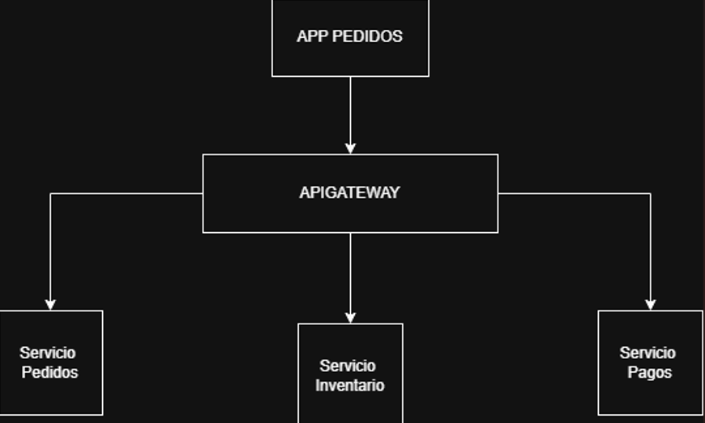
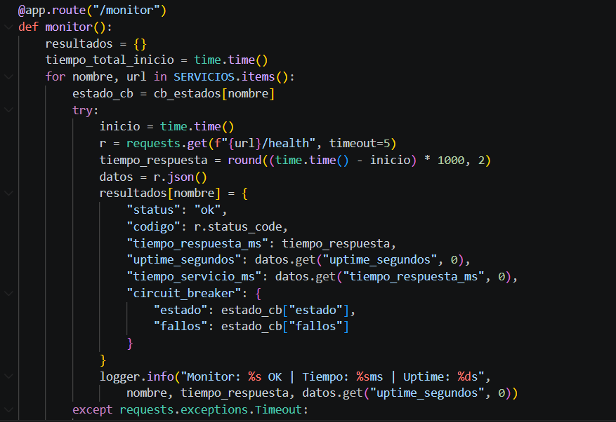
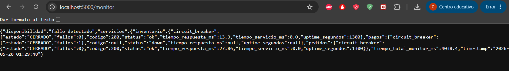
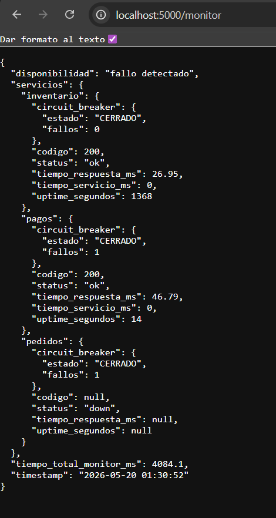
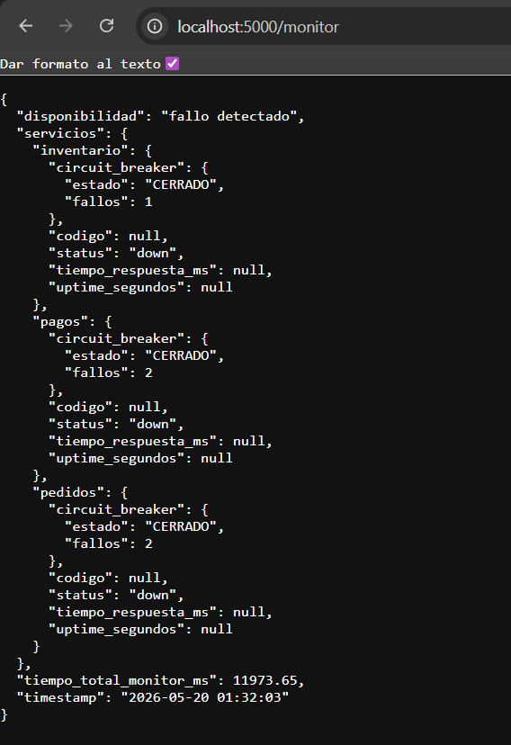
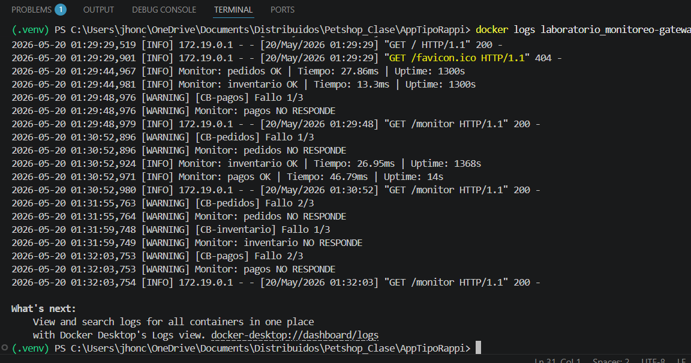

# Arquitectura del Sistema: Pedidos

Una aplicación Pedidos que se contruyo con una arquitectura distribuida

Integrantes:

Samir Ausecha - Encargado de documentación
Jhon Cabezas - Lider del proyecto

Link Git:
https://github.com/JhoncsQA/AppTipoRappi.git

## Servicios del sistema

COntruccion del Monitor

Prueba de servicios 

Evidencia logs

